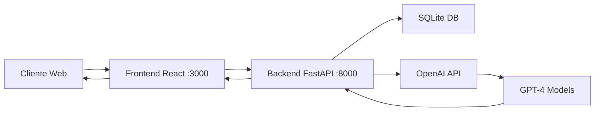

# Financial Restructuring Assistant

AI-powered financial debt restructuring assistant for bank customers. Complete full-stack implementation with React frontend and FastAPI backend, using modern technologies like Bun, shadcn/ui, LangChain agents, and OpenAI GPT models with Spanish-language focus.

## 🚀 Quick Start - Ejecución Local

### Opción 1: Docker Compose (Recomendado - Todo en uno)

**Pre-requisitos:**
- Docker Desktop instalado ([Descargar aquí](https://www.docker.com/products/docker-desktop/))
- Git instalado
- Clave API de OpenAI ([Obtener aquí](https://platform.openai.com/api-keys))

**Pasos:**

1. **Clonar el repositorio:**
```bash
git clone <repository>
cd bcp_test
```

2. **Configurar variables de entorno:**
```bash
# Crear archivo .env en la raíz del proyecto
cat > .env << EOF
# OpenAI API Configuration
OPENAI_API_KEY=tu_clave_api_de_openai_aqui

# Database Configuration
DATABASE_URL=sqlite:///app/database/financial_assistant.db

# Application Configuration
DEBUG=true
LOG_LEVEL=INFO
LOAD_SAMPLE_DATA=true

# LangChain Configuration (opcional)
LANGSMITH_TRACING=false
EOF
```

3. **Ejecutar la aplicación completa:**
```bash
# Construir y ejecutar todos los servicios
docker-compose up --build

# O ejecutar en segundo plano
docker-compose up --build -d
```

4. **Acceder a la aplicación:**
- 🌐 **Frontend (Interfaz de Usuario)**: http://localhost:3000
- 🔧 **Backend API**: http://localhost:8000
- 📚 **Documentación API**: http://localhost:8000/docs

5. **Cargar datos de prueba (primera vez):**
```bash
# Una vez que el backend esté ejecutándose
curl -X POST "http://localhost:8000/api/v1/load-data"
```

6. **Detener la aplicación:**
```bash
# Si está ejecutándose en primer plano: Ctrl+C
# Si está en segundo plano:
docker-compose down

# Para eliminar también los volúmenes de datos:
docker-compose down -v
```

### Opción 2: Desarrollo Local Nativo

#### Pre-requisitos

**Frontend:**
- Node.js 18+ ([Descargar](https://nodejs.org/))
- Bun ([Instalar](https://bun.sh/))

**Backend:**
- Python 3.11+ ([Descargar](https://www.python.org/))
- UV package manager ([Instalar](https://docs.astral.sh/uv/))

#### Frontend - Desarrollo Local

```bash
# 1. Navegar al directorio frontend
cd frontend

# 2. Instalar Bun si no lo tienes
curl -fsSL https://bun.sh/install | bash
# Reiniciar terminal o ejecutar: source ~/.bashrc

# 3. Instalar dependencias
bun install

# 4. Configurar backend URL (opcional si el backend corre en otro puerto)
# Editar vite.config.ts si es necesario

# 5. Ejecutar en modo desarrollo
bun run dev

# La aplicación estará disponible en http://localhost:5173
```

**Comandos útiles del frontend:**
```bash
# Construir para producción
bun run build

# Previsualizar build de producción
bun run preview

# Linter
bun run lint

# Verificar tipos de TypeScript
bun run type-check
```

#### Backend - Desarrollo Local

```bash
# 1. Navegar al directorio backend
cd backend

# 2. Instalar UV si no lo tienes
curl -LsSf https://astral.sh/uv/install.sh | sh
# Reiniciar terminal o ejecutar: source ~/.local/bin/env

# 3. Crear y configurar .env en el directorio backend
cat > .env << EOF
OPENAI_API_KEY=tu_clave_api_de_openai_aqui
DATABASE_URL=sqlite:///./financial_assistant.db
DEBUG=true
LOG_LEVEL=INFO
LOAD_SAMPLE_DATA=true
EOF

# 4. Instalar dependencias del proyecto
uv sync

# 5. Ejecutar el servidor de desarrollo
uv run uvicorn app.main:app --reload --host 0.0.0.0 --port 8000

# El API estará disponible en http://localhost:8000
```

**Comandos útiles del backend:**
```bash
# Cargar datos de prueba
curl -X POST "http://localhost:8000/api/v1/load-data"

# Ejecutar tests
uv run pytest

# Formatear código
uv run black .
uv run isort .

# Verificar tipos
uv run mypy app

# Ver logs en tiempo real
tail -f logs/app.log
```

### Opción 3: Desarrollo Híbrido

Puedes ejecutar el backend con Docker y el frontend localmente (o viceversa):

**Backend con Docker + Frontend local:**
```bash
# Terminal 1: Backend
docker-compose up backend

# Terminal 2: Frontend
cd frontend
bun run dev
```

**Frontend con Docker + Backend local:**
```bash
# Terminal 1: Frontend
docker-compose up frontend

# Terminal 2: Backend
cd backend
uv run uvicorn app.main:app --reload
```

## 🔧 Configuración

### Variables de Entorno Importantes

| Variable | Descripción | Requerido | Valor por defecto |
|----------|-------------|-----------|-------------------|
| `OPENAI_API_KEY` | Clave API de OpenAI | ✅ Sí | - |
| `DATABASE_URL` | URL de conexión a base de datos | No | `sqlite:///./financial_assistant.db` |
| `LOAD_SAMPLE_DATA` | Cargar datos de ejemplo al iniciar | No | `false` |
| `DEBUG` | Modo debug (más logs) | No | `false` |
| `LOG_LEVEL` | Nivel de logging | No | `INFO` |
| `LANGSMITH_TRACING` | Habilitar tracing con LangSmith | No | `false` |
| `CORS_ORIGINS` | Orígenes CORS permitidos | No | `["http://localhost:3000", "http://localhost:5173"]` |

### Puertos Utilizados

| Servicio | Puerto | Descripción |
|----------|--------|-------------|
| Frontend | 3000 | React app (Docker) |
| Frontend (desarrollo) | 5173 | Vite dev server |
| Backend API | 8000 | FastAPI server |

## 🧪 Pruebas Rápidas

### 1. Verificar que el backend está funcionando:
```bash
curl http://localhost:8000/api/v1/health
# Respuesta esperada: {"status":"healthy","database":"connected"}
```

### 2. Cargar datos de ejemplo:
```bash
curl -X POST http://localhost:8000/api/v1/load-data
# Respuesta: {"message":"Sample data loaded successfully","customers_count":3}
```

### 3. Obtener lista de clientes:
```bash
curl http://localhost:8000/api/v1/customers
# Respuesta: Lista de clientes con sus deudas
```

### 4. Analizar deuda de un cliente:
```bash
curl -X POST http://localhost:8000/api/v1/customers/CU-001/analyze
# Respuesta: Análisis completo con 3 escenarios
```

## 🐛 Solución de Problemas Comunes

### Error: "OpenAI API key not found"
**Solución:** Asegúrate de que la variable `OPENAI_API_KEY` esté configurada en tu archivo `.env`

### Error: "Cannot connect to database"
**Solución:** 
- Con Docker: Verifica que el contenedor esté ejecutándose
- Local: Verifica que el path de la base de datos sea correcto

### Error: "Port 8000 already in use"
**Solución:**
```bash
# Encontrar proceso usando el puerto
lsof -i :8000
# Terminar el proceso
kill -9 <PID>
# O cambiar el puerto en el comando uvicorn
uv run uvicorn app.main:app --reload --port 8001
```

### Error: "CORS blocked"
**Solución:** Verifica que el frontend esté accediendo al backend en el puerto correcto (8000)

### Frontend no puede conectar con backend
**Solución:** 
1. Verifica que el backend esté ejecutándose
2. Revisa la configuración del proxy en `frontend/vite.config.ts`
3. Asegúrate de usar las URLs correctas

### Docker build muy lento
**Solución:** 
- Usa Docker BuildKit: `DOCKER_BUILDKIT=1 docker-compose build`
- Limpia caché: `docker system prune -a`

## 📊 Arquitectura del Sistema

### Stack Tecnológico

**Frontend:**
- ⚛️ React 18 + TypeScript
- 🎨 Tailwind CSS + shadcn/ui
- ⚡ Vite + Bun
- 📊 Recharts para visualizaciones

**Backend:**
- 🐍 Python 3.11 + FastAPI
- 🤖 LangChain + OpenAI GPT
- 💾 SQLAlchemy + SQLite/PostgreSQL
- 📦 UV package manager

**Infraestructura:**
- 🐳 Docker + Docker Compose
- 📝 Auto-documentación con Swagger

### Flujo de Datos



## 📚 Documentación Adicional

- **API Interactiva**: http://localhost:8000/docs
- **ReDoc**: http://localhost:8000/redoc
- **OpenAPI Schema**: http://localhost:8000/openapi.json
- **Memory Bank**: Ver carpeta `memory-bank/` para documentación del proyecto

## 🤝 Contribución

1. Fork el repositorio
2. Crea una rama para tu feature (`git checkout -b feature/AmazingFeature`)
3. Commit tus cambios (`git commit -m 'Add some AmazingFeature'`)
4. Push a la rama (`git push origin feature/AmazingFeature`)
5. Abre un Pull Request

## 📄 Licencia

Este proyecto es para fines demostrativos. Asegúrate de cumplir con las regulaciones financieras de tu jurisdicción.

## 💡 Tips para Desarrollo

- **Hot Reload**: Tanto el frontend como el backend tienen hot reload activado en modo desarrollo
- **Logs**: Revisa los logs en `backend/logs/` para debugging
- **Base de datos**: SQLite para desarrollo, PostgreSQL recomendado para producción
- **Tests**: Ejecuta `uv run pytest` en el backend antes de hacer commit
- **Linting**: Usa `bun run lint` en frontend y `uv run black .` en backend

## 🆘 Soporte

Si encuentras problemas:
1. Revisa la sección de [Solución de Problemas](#-solución-de-problemas-comunes)
2. Verifica los logs del contenedor: `docker-compose logs -f`
3. Asegúrate de tener todas las variables de entorno configuradas
4. Revisa que los puertos no estén en uso
5. Consulta la documentación en `memory-bank/`